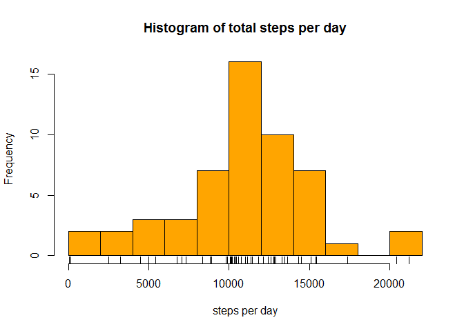
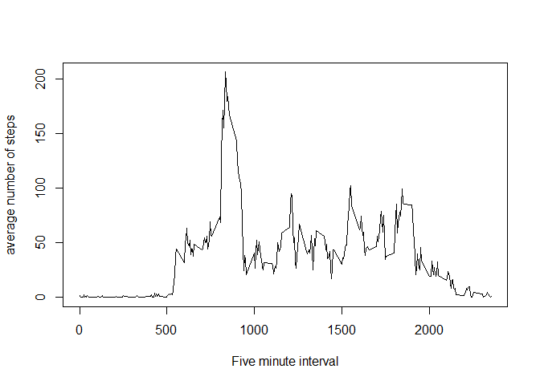
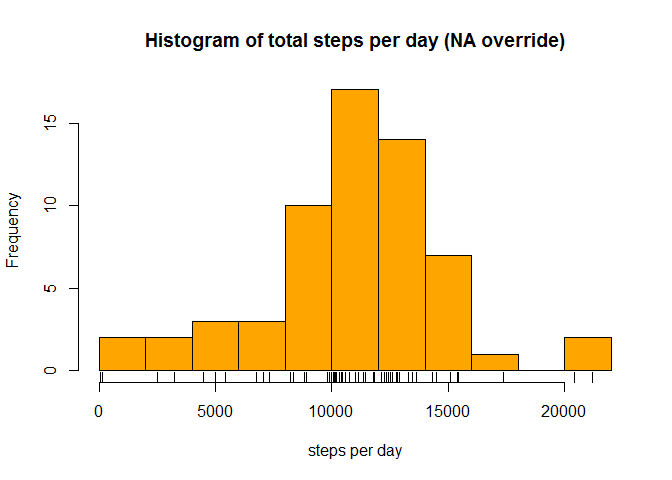
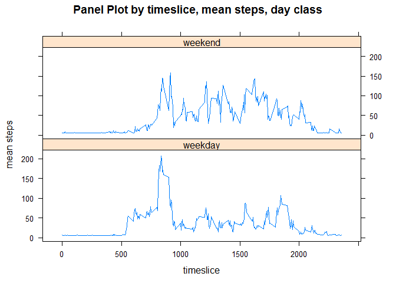

# Reproducible Research: Peer Assessment 1

## Loading and preprocessing the data

```r
    df <-na.omit(read.csv("activity.csv"))
```


## What is mean total number of steps taken per day?

```r
    totalperday <-aggregate(df$steps,by=list(df$date),sum)
    hist(totalperday$x,breaks=10,xlab="steps per day",
         main= "Histogram of total steps per day", col = "orange")
    rug(totalperday$x)
```

 
  
Steps per day mean = 10766  
Steps per day median = 10765


## What is the average daily activity pattern?

```r
    meanperTS <- aggregate(df$steps, by=list(df$interval),mean)
    plot(meanperTS,type="l",xlab="Five minute interval",
         ylab="average number of steps")
```

 
  
Max average interval slice is 104 , corresponding to 
8:40 - 
8:45
with 206.17 steps

## Input missing values

```r
    require("lubridate")
```

```
## Loading required package: lubridate
```

```r
    require("lattice")
```

```
## Loading required package: lattice
```

```r
    df <-read.csv("activity.csv")
    df$wday <- wday(df$date)    ## assign weekday
    blankrows <- is.na(df$steps) # logical of blank rows
    totalmissing = sum(blankrows)

    #get avg by wday to plug into 
    averagedf <- aggregate(df$steps[!blankrows],
                            by=list(df$wday[!blankrows]),mean)
    weekday1 <- df$wday==1
    weekday2 <- df$wday==2
    weekday3 <- df$wday==3
    weekday4 <- df$wday==4
    weekday5 <- df$wday==5
    weekday6 <- df$wday==6
    weekday7 <- df$wday==7
    df[blankrows & weekday1,]$steps <- averagedf$x[averagedf$Group.1 == 1]
    df[blankrows & weekday2,]$steps <- averagedf$x[averagedf$Group.1 == 2]
    #df[blankrows & weekday3,]$steps <- averagedf$x[averagedf$Group.1 == 3]
    df[blankrows & weekday4,]$steps <- averagedf$x[averagedf$Group.1 == 4]
    df[blankrows & weekday5,]$steps <- averagedf$x[averagedf$Group.1 == 5]
    df[blankrows & weekday6,]$steps <- averagedf$x[averagedf$Group.1 == 6]
    df[blankrows & weekday7,]$steps <- averagedf$x[averagedf$Group.1 == 7]

    # generate histogram
    totalperday <-aggregate(df$steps,by=list(df$date),sum)
    hist(totalperday$x,breaks=10,xlab="steps per day",
         main= "Histogram of total steps per day (NA override)", col = "orange")
    rug(totalperday$x)
```

 
  
total number of missing values = 2304.  
The mean for each weekday was used to replace the missing values.

Steps per day mean = 10821  
Steps per day median = 11015

The mean and median are higher because we are adding steps where none previously 
existed (the NA values)  

## Are there differences in activity patterns between weekdays and weekends?

```r
    df$dayclass <- df$wday
    df$dayclass[which((df$dayclass == 7) | (df$dayclass == 1))] <- "weekend"
    df$dayclass[which(df$dayclass != "weekend")] <- "weekday"
    meanperTS <- aggregate(df$steps,
                           by=list(interval=df$interval,
                                   dayclass=df$dayclass),mean)
    xyplot(meanperTS$x~meanperTS$interval | meanperTS$dayclass,
           type = "l", main="Panel Plot by timeslice, mean steps, day class",
           ylab="mean steps", xlab="timeslice",
           layout = (c(1,2)))
```

 
